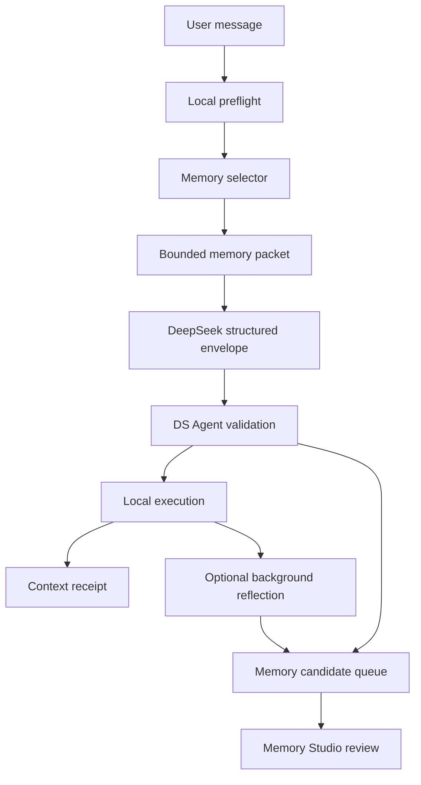

# DS Agent Memory Runtime v1 Design

Date: 2026-07-06

## 1. Purpose

Upgrade DS Agent memory from a passive Memory Studio surface into a bounded
runtime capability for loop engineering.

The goal is not to make every DS Agent task slower, more complicated, or more
memory-driven. Memory should help a one-sentence task start with the right
local context when that context is clearly useful. The hot path must stay
small, deterministic, inspectable, and easy to disable.

Memory Runtime v1 should let DS Agent:

- keep a small long-lived `soul.md` profile for names, forms of address, and
  stable user preferences;
- remember personalized response defaults such as tone, verbosity, language,
  formatting, and how much initiative DS Agent should take;
- select a few relevant reviewed memories before calling DeepSeek;
- record why each memory was selected;
- inject only compact, safe memory snippets into the model packet;
- show a context receipt so users can see what influenced the run;
- accept memory suggestions only as reviewable candidates;
- avoid silent writes, privacy leaks, memory poisoning, and endless memory
  optimization loops.

## 2. Reference Patterns

These references shape the design, but DS Agent should not copy their full
systems into the first implementation.

- Claude Code memory separates user-written project instructions from automatic
  local memory. Its documented behavior treats memory as context rather than
  enforcement, scopes automatic memory locally, and exposes a `/memory` command
  for visibility and control:
  <https://docs.anthropic.com/en/docs/claude-code/memory>
- Codex `AGENTS.md` guidance shows a useful split between durable project rules
  and runtime memory. It favors small, practical repository instructions:
  <https://developers.openai.com/codex/guides/agents-md>
- OpenClaw's `SOUL.md` template treats identity, boundaries, tone, and
  continuity as a persistent workspace file. DS Agent should borrow the idea of
  an explicit, inspectable identity file, but narrow it to a practical local
  profile rather than a hidden personality system:
  <https://docs.openclaw.ai/reference/templates/SOUL>
- mem0 is a broad memory layer for AI agents and assistants. DS Agent can learn
  from its SDK-style memory primitives and evaluation mindset, but should not
  add an external memory dependency in v1:
  <https://github.com/mem0ai/mem0>
- Graphiti emphasizes temporal knowledge graphs, provenance, and changing facts.
  DS Agent should borrow the ideas of lifecycle, provenance, and replacement
  without adding graph infrastructure in v1:
  <https://github.com/getzep/graphiti>
- agentmemory is a coding-agent memory project with hooks, hybrid retrieval,
  token budgets, visible replay, and many skills. DS Agent should borrow the
  lifecycle coverage and observability ideas, while avoiding silent capture and
  always-on injection:
  <https://github.com/rohitg00/agentmemory>
- Basic Memory shows the value of local-first, human-readable Markdown, graph
  links, MCP tool annotations, and notes that people can edit. DS Agent should
  keep `soul.md` and memory receipts inspectable, but v1 should not add a
  separate Markdown knowledge-base server:
  <https://github.com/basicmachines-co/basic-memory>
- LangMem separates memory primitives from storage and supports agent learning
  over time. DS Agent should borrow the hot-path versus background-management
  split:
  <https://github.com/langchain-ai/langmem>

Downloaded review snapshots on 2026-07-06:

- `mem0ai/mem0`: 60,152 stars, updated 2026-07-06.
- `getzep/graphiti`: 28,395 stars, updated 2026-07-06.
- `topoteretes/cognee`: 27,137 stars, updated 2026-07-06.
- `rohitg00/agentmemory`: 24,599 stars, updated 2026-07-06.
- `basicmachines-co/basic-memory`: 3,379 stars, updated 2026-07-05.

Temporary local research path:
`%TEMP%/dsagent-memory-research-20260706`.

## 3. Existing DS Agent Baseline

Current source already has the important foundation:

- `MemoryRecord` and `MemoryCandidate` support type, scope, sensitivity,
  lifecycle, expiration, source links, and review-safe defaults.
- `EventStore` persists memory as append-only kernel events and already filters
  deleted and expired memory from visible records.
- Memory Studio supports pending candidates, conflict surfacing, link, merge,
  replace, edit, delete, and expiration workflows.
- Agent chat responses already parse DeepSeek `memory_candidates` and store
  them as pending review items only.
- `AgentContextReceipt` already has a `selected_memories` field, but central
  chat currently records that memory selection is not wired into context
  receipts.
- `build_agent_chat_protocol_user_prompt` currently includes protocol,
  capability, and loop-contract instructions, but does not include selected
  memory or `soul.md` context.
- The frontend receipt summary currently shows evidence, validation, policy,
  and omissions, but does not surface `selected_memories` as a first-class line
  in the right rail.
- Codegraph marks `MemoryRecord`, `MemoryCandidate`, `list_memory_records`, and
  `AgentContextReceipt` as high-blast-radius symbols with weak focused test
  coverage. Memory Runtime v1 should add tests before broad behavior changes.

Memory Runtime v1 should reuse these pieces instead of adding a second memory
store.

The main missing piece is a tiny always-available identity profile. Existing
`MemoryRecord` objects are good for project context and workflow facts, but the
user also needs DS Agent to remember stable relationship-level facts: what the
user wants to be called, how the user calls DS Agent, preferred language and
tone, and durable interaction preferences. These facts should live in a
separate, user-visible `soul.md` profile so they are not buried among task
memories.

## 4. Non-Goals

Memory Runtime v1 must not:

- add embeddings, a vector database, or a knowledge graph dependency;
- turn `soul.md` into a persona marketplace, roleplay layer, or hidden identity
  prompt;
- call a model just to select memory before every task;
- write long-term memory silently from a model response;
- load all memory records into the DeepSeek prompt;
- treat memory as permission, policy, or an override of user intent;
- optimize, summarize, or rebuild memory recursively during the user's active
  task;
- block local actions while background memory work is running;
- expose raw secrets, API keys, private local paths, or unrelated private
  evidence to the model.

## 5. Design Principles

### Memory Serves the Loop

Memory enters the loop only when it helps the current task. The core loop stays:

1. local deterministic preflight;
2. compact context packet;
3. DeepSeek reasoning when needed;
4. DS Agent validation and local execution;
5. evidence validation;
6. reviewable memory candidate proposal;
7. audit and receipt.

### Hot Path Is Cheap

The central chat hot path gets one local memory-selection pass. No model call,
background compaction, recursive search, or multi-stage memory refinement runs
before the first DeepSeek request.

### Review Beats Automation

Memory candidates are useful because they are reviewable. DS Agent should make
accept, edit, link, merge, replace, and reject easy. It should not make
unreviewed memory writes invisible.

### Memory Is Context, Not Authority

Memory can influence the model packet, but it cannot grant permissions, bypass
path checks, approve actions, or override the user's newest instruction.

### Receipts Build Trust

Every selected memory should leave a short receipt: what was selected, why it
was selected, what was sent, what was omitted, and what budget was applied.

### Recall Must Be Provable

Users should not have to trust a vague claim that DS Agent "has memory." The
runtime must make recall visible and measurable:

- if memory was used, show the selected memory lines and reasons;
- if no memory was used, show `No relevant reviewed memory selected`;
- if memory was omitted, show a safe omission reason;
- if the user explicitly says "remember this", open a reviewable candidate or
  `soul.md` patch instead of silently burying the fact;
- keep a small golden recall fixture so future changes can prove that common
  repeated preferences, project facts, and workflow decisions are recalled.

### Local Files Beat Black Boxes

Codex, Claude Code, OpenClaw, and Basic Memory all point to the same user
expectation: durable context should be inspectable. DS Agent should keep the
runtime store structured, but users need a plain surface for the most personal
facts:

- `soul.md` for identity and stable preferences;
- Memory Studio for reviewed operational/project memories;
- context receipts for "what influenced this run";
- work-package or handoff records for long-running project continuity.

## 6. Runtime Architecture



The memory selector is deterministic Rust code in the desktop kernel or command
layer. It reads visible long-term memory from `EventStore`, applies filters,
ranks candidates, creates compact snippets, and returns a packet plus receipt
metadata.

The selector does not mutate memory.

## 7. Data Shapes

### Soul Memory Profile

`soul.md` is a small local Markdown profile owned by the user and DS Agent
together. It is loaded before ordinary memory selection because it carries
stable identity and preference context, not task-specific evidence.

Default storage:

- machine-local DS Agent app data: `memory/soul.md`;
- not exported in work packages by default;
- not committed to the DS Agent source repository;
- editable from Memory Studio or an advanced local file action.

The file should stay human-readable. Suggested shape:

```markdown
# DS Agent Soul

schema_version: 1
updated_at: 2026-07-06T00:00:00Z

## User

- preferred_name:
- address_as:
- language_preferences:
- default_response_tone:
- default_response_length:
- formatting_preferences:
- initiative_level:

## DS Agent

- user_calls_ds_agent:
- ds_agent_should_refer_to_itself_as:
- relationship_boundary:

## Stable Preferences

- workflow_preferences:
- writing_preferences:
- confirmation_preferences:
- privacy_preferences:

## Never Store

- secrets
- passwords
- private account identifiers
- sensitive personal data unless the user explicitly approves
```

The profile is intentionally boring. It should remember useful continuity such
as "call the user Mr. Li", "the user calls the app DS Agent", "prefer Chinese
for business writing", "default to concise direct replies", "use detailed
technical explanations only when asked", or "ask before external sends". It
should not invent a fictional identity, claim emotions, impersonate the user,
or store intimate private facts by default.

Explicit user settings are stronger than inferred memory. If DS Agent later
adds settings such as "default response tone", "default reply length", or
"default language", those values should write through to the profile as
user-approved personalization fields. Model-inferred candidates may suggest
changes, but they must not overwrite explicit settings without review.

DS Agent may propose updates to `soul.md`, but the user must review and accept
the patch. Accepted updates should be recorded as append-only events or file
history notes so users can inspect what changed and why.

### Explicit Remember Requests

When the newest user message contains an explicit memory intent such as
`remember`, `记住`, `以后默认`, or `下次不要忘了`, DS Agent should treat it as a
memory-capture request in addition to answering the task.

Default v1 behavior:

- classify whether the fact belongs in `soul.md` or a normal `MemoryRecord`;
- produce a prefilled review card or `soul.md` patch;
- show why DS Agent thinks the fact is durable;
- require review before the long-term write is committed;
- for low-risk explicit preferences, the UI may offer a one-click `Remember`
  action, but the action must still be visible and auditable;
- for sensitive facts, secrets, private identifiers, account data, health,
  finance, or intimate personal details, require explicit confirmation and
  mark the candidate as sensitive or reject it as not storable.

The product promise is: if a user says something should be remembered, DS Agent
should visibly capture it as a candidate unless safety rules block it. The
runtime should never let an explicit remember request vanish silently.

### Selected Memory Context

Rust model, JSON-serializable:

```rust
pub struct AgentSelectedMemory {
    pub memory_id: Uuid,
    pub title: String,
    pub memory_type: MemoryType,
    pub scope: MemoryScope,
    pub sensitivity: MemorySensitivity,
    pub match_reason: String,
    pub inclusion_mode: MemoryInclusionMode,
    pub snippet: String,
    pub snippet_bytes: usize,
    pub omitted_fields: Vec<String>,
}

pub enum MemoryInclusionMode {
    Snippet,
    TitleOnly,
    OmittedSensitive,
    OmittedBudget,
}
```

### Memory Selection Receipt

```rust
pub struct AgentMemorySelectionReceipt {
    pub query: String,
    pub soul_profile_used: bool,
    pub selected: Vec<AgentSelectedMemory>,
    pub omitted: Vec<String>,
    pub max_memories: usize,
    pub max_context_bytes: usize,
    pub created_at: DateTime<Utc>,
}
```

This receipt is projected into `AgentContextReceipt.selected_memories` as compact
human-readable lines for v1. A richer typed receipt can become its own event in
v2 if the UI needs drill-down.

### Soul Profile Context

The prompt packet should include a compact identity section before selected task
memories when `soul.md` exists:

```text
DS Agent identity profile:
- user preferred address: Mr. Li
- user calls this app: DS Agent
- response defaults: Chinese for business writing; concise and factual; avoid
  unsolicited long explanations
Profile limits: soul.md compact summary, raw file body omitted.
```

This section has its own small budget, separate from task memory retrieval. The
default budget is `800` bytes.

## 8. Selection Rules

Default limits:

- max `soul.md` profile packet: `800` bytes;
- max selected memories: `3`;
- max memory context packet: `1200` bytes;
- max snippet per memory: `280` characters;
- max pending candidates accepted from one model response: `3`;
- max candidate body length from model response: `1200` characters.

Filters:

- include only visible records from `EventStore::list_memory_records`;
- exclude expired and deleted memories through existing store projection;
- exclude `MemoryLifecycle::Archived` from hot-path injection;
- exclude `MemorySensitivity::Sensitive` by default, recording an omission;
- prefer `Project`, `Workspace`, then `User`, then `Organization` scope for a
  local DS Agent task unless the task explicitly names a broader context;
- never include source-machine-only path handles unless the current task and
  capability need them.

`soul.md` rules:

- load only the compact profile summary, not arbitrary Markdown body text;
- include user naming and DS Agent naming fields by default when present;
- include stable language, response tone, verbosity, formatting, initiative,
  workflow, and confirmation preferences only when they fit the profile budget;
- omit anything listed under `Never Store` or marked sensitive;
- if the newest user message conflicts with `soul.md`, the newest user message
  wins and the receipt records the conflict.

Ranking:

- direct title match;
- direct body match;
- linked memory title match;
- linked memory body match;
- pinned memory bonus;
- recent update as tie-breaker.

Ranking should stay explainable. Every selected item must produce a short
`match_reason`, such as `title match: office` or `linked memory body match:
release`.

## 9. Prompt Packet

`build_agent_chat_protocol_user_prompt` should include a compact section only
when the soul profile or task memories are selected:

```text
DS Agent identity profile:
- user preferred address: Mr. Li
- user calls this app: DS Agent
- response defaults: Chinese for business writing; concise and factual; direct
  answer first
```

```text
Selected reviewed DS Agent memories for this run:
- [project_context/workspace] DS Agent boundary
  reason: title match: boundary
  snippet: DS Agent owns deterministic execution, permissions, audit, artifacts...
Memory selection limits: 1 selected, 392 bytes used, sensitive memories omitted.
```

If no memory is selected, the prompt should not carry a large empty section.
If no `soul.md` profile exists, the prompt should not mention it.

If memory was omitted, the prompt can include a compact line such as:

```text
Memory omissions: 2 sensitive memories omitted; 1 match omitted by budget.
```

This tells DeepSeek why context may be incomplete without leaking the omitted
content.

## 10. Candidate Generation

DeepSeek may return memory candidates in the existing structured envelope. DS
Agent must validate them before adding pending events:

- drop blank title or body;
- trim title, body, and rationale;
- cap candidate count per response;
- cap body length and add an omission note if truncated;
- normalize type, scope, sensitivity, lifecycle, and expiration;
- default unknown values to review-safe metadata;
- detect conflicts through existing Memory Studio logic;
- store as `MemoryCandidateSource::WorkflowReflection`;
- never create `MemoryRecord` until the user accepts, edits, links, merges, or
  replaces through Memory Studio.

Candidate generation should run after the user-visible task result. If
candidate validation is slow or fails, the task result should still complete.

## 11. Background Memory Work

Background memory work is optional and never part of the critical path.

Allowed background jobs:

- propose a memory candidate from a completed run;
- suggest that an old memory should be archived or replaced;
- generate a short conflict hint for Memory Studio.

Disallowed background jobs:

- automatic long-term writes;
- recursive memory summarization during an active task;
- broad re-indexing on every chat message;
- model-driven memory optimization loops without a user-visible stop condition.

Background jobs should have:

- fixed concurrency of one;
- small time budget;
- skip behavior when the app is busy;
- explicit audit entries for candidate creation;
- no retries beyond one immediate retry for transient local errors.

## 12. UI and User Controls

Memory Runtime v1 should reuse the existing chat-first workbench.

Central chat:

- assistant messages continue to show pending memory candidates;
- no new modal is needed for v1.

Right run/status rail:

- show whether the `soul.md` profile was used;
- show a memory step with the first selected memory or `No memory selected`;
- show recent context receipts with selected memory lines;
- show omission lines when sensitive or over-budget memory was not included.

Memory Studio:

- add a small `Soul profile` section for user address, DS Agent name, language,
  default response tone, default response length, formatting, initiative,
  workflow, confirmation, and privacy preferences;
- keep candidate review as the main long-term write surface;
- add filters later for `Used recently`, `Sensitive`, and `Candidate source`.

Future `/memory`-style command:

- show the current `soul.md` summary;
- offer `edit soul profile`;
- list memory files/records influencing the current run;
- toggle memory retrieval for the session;
- open Memory Studio;
- disable auto candidate generation for the session.

This command is useful, but not required for the first implementation slice.

## 13. Privacy and Safety

Memory Runtime v1 must defend against:

- secret leakage into model context;
- private local path leakage;
- over-personalized or fictional `soul.md` content drifting DS Agent away from
  its product boundary;
- memory poisoning from model output or imported packages;
- stale memory overriding newer user instruction;
- sensitive memories entering ordinary chat packets;
- candidate spam that overwhelms review.

Rules:

- user prompt and explicit current task override memory;
- `soul.md` is a profile, not a higher-priority system prompt;
- policy and capability checks override memory;
- sensitive memory requires explicit inclusion logic;
- user address, DS Agent naming, and stable preferences may be stored; secrets,
  passwords, payment data, private identifiers, and intimate sensitive details
  must not be stored without explicit user approval;
- explicit personalization settings such as default response tone or verbosity
  win over model-inferred candidates;
- candidate writes are review-only;
- imported candidates remain pending review;
- receipts record omissions without revealing omitted content.

Common memory-system failures to avoid:

- **Forgotten explicit preference:** user says "remember this" and no visible
  candidate appears. Fix: explicit remember requests always create a review
  surface or a safe refusal.
- **Silent capture:** background jobs store facts the user never saw. Fix: all
  long-term writes go through candidate review or an explicit one-click
  remember action.
- **Context flooding:** the model receives too many memories and loses the task.
  Fix: top-k, byte budgets, and receipt-backed omissions.
- **Stale override:** an old memory beats the newest user message. Fix: newest
  user instruction always wins and conflict is recorded.
- **Poisoned memory:** model output or imported packages inject instructions.
  Fix: memory is quoted context, never a system/developer instruction or
  permission source.
- **Private path or secret leakage:** raw local evidence enters the model
  packet unnecessarily. Fix: safe snippets and omission lines by default.
- **Unbounded optimization:** memory maintenance becomes the task. Fix: no
  recursive summarization or retrieval-repair loop on the hot path.
- **No proof of usefulness:** memory exists but users cannot see it working.
  Fix: selected-memory receipts, small recall fixtures, and UI summaries.

## 14. Performance Budget

Memory should not make DS Agent feel slower.

Targets for v1 on a normal local store:

- memory selection p95 under 50 ms for 500 records;
- prompt packet under 1200 bytes by default;
- no additional model call before the first DeepSeek request;
- no UI-blocking background memory job;
- no more than one candidate validation pass per model response.

If the store grows beyond the simple contains search envelope, the next upgrade
should be SQLite FTS or BM25-style ranking before embeddings or graph retrieval.

### Memory Quality Gates

Before shipping a retrieval upgrade beyond simple matching, DS Agent should keep
a small local fixture suite:

- explicit user preference recall, such as response tone and preferred name;
- project fact recall, such as the current branch or release boundary;
- workflow pitfall recall, such as a known Windows or Office failure mode;
- stale-conflict recall, where the newest user message overrides old memory;
- sensitive omission, where a matching secret-like memory is not injected;
- budget pressure, where only the best top-k memories are selected.

Suggested metrics:

- `recall_at_3` for the expected memory id or title;
- `wrong_injection_count` for memories that should not enter the packet;
- `packet_bytes` for `soul.md` and selected task memories;
- `selection_latency_ms`;
- `receipt_completeness`, meaning selected, omitted, reason, and budget lines
  are present.

These checks should run without network access, embeddings, or a model call.
They are the guardrail that prevents memory work from becoming slow, expensive,
or unverifiable.

## 15. Implementation Slices

### Slice 0: Research-Derived Spec Tightening

- Keep external reference ideas mapped to DS Agent objects: selector, packet,
  receipt, candidate, `soul.md`, and Memory Studio.
- Do not add mem0, Graphiti, agentmemory, or Basic Memory as runtime
  dependencies in v1.
- Use downloaded external projects as design input only; no vendored code.

### Slice 1: Central Chat Memory Context v1

- Add `soul.md` profile loading with an `800` byte compact identity packet.
- Include explicit personalization settings such as default response tone,
  response length, language, formatting, and initiative level in that packet.
- Add selector data types and constants.
- Select up to three non-sensitive active memories before DeepSeek chat.
- Add compact selected memory packet to the protocol prompt.
- Fill `AgentContextReceipt.selected_memories`.
- Replace the current central-chat omission saying memory is not wired.
- Make `selected_memories` visible in the frontend receipt summary.
- Add an explicit remember-intent detector that creates a prefilled candidate
  or `soul.md` patch for review.
- Add focused Rust tests for selection, omission, prompt packet, receipt, and
  candidate review-only behavior.

### Slice 2: Candidate Validation Hardening

- Cap candidate count and body size.
- Record truncation or dropped-candidate reasons.
- Add tests that model-suggested memory cannot bypass review or flood the queue.

### Slice 3: UI Receipt Polish

- Add a compact Memory Studio `Soul profile` editor for naming and stable
  preferences, including default tone and response length.
- Surface selected memories and omissions in the right rail.
- Add compact copy for no-memory, selected-memory, and omitted-sensitive states.
- Keep the central chat uncluttered.

### Slice 4: Background Reflection Queue

- Add an optional background job that proposes candidates after completed runs.
- Keep it disabled or conservative by default until v1 telemetry proves the hot
  path is stable.

### Slice 5: Retrieval Upgrade

- Add SQLite FTS/BM25 and simple recency/temporal weighting only if fixtures or
  real usage show simple contains search is too weak.
- Keep graph traversal limited to existing `linked_memory_ids` before adding a
  dedicated knowledge graph.
- Revisit embeddings only after local data volume requires semantic recall and
  the user can inspect, disable, and rebuild the index.

### Slice 6: Recall Evaluation Harness

- Add fixture memories and deterministic queries for `recall_at_3`,
  wrong-injection, sensitivity omission, stale override, and budget pressure.
- Run the harness in Rust tests first; add UI smoke only after the receipt
  surface exists.

## 16. Test Plan

Focused Rust tests:

- `soul.md` profile fields appear in the DeepSeek prompt packet within budget;
- explicit default response tone and verbosity settings appear in the compact
  identity packet when present;
- newest user instruction overrides conflicting `soul.md` preferences;
- inferred personalization candidates cannot overwrite explicit settings
  without review;
- `soul.md` never injects secrets or fields from the `Never Store` section;
- explicit `remember this` requests create a reviewable candidate or `soul.md`
  patch instead of disappearing silently;
- selected memory appears in the DeepSeek prompt packet;
- sensitive memory is omitted and only an omission reason is included;
- archived and expired memories are excluded;
- linked memory matches produce explainable reasons;
- selection respects top-k and byte limits;
- context receipts record selected memory lines;
- frontend receipt summaries surface selected memory lines when present;
- stale memories lose to the newest user message and record the conflict;
- golden recall fixtures pass `recall_at_3`, wrong-injection, sensitivity
  omission, stale-override, and budget-pressure checks;
- model `memory_candidates` remain pending review and do not create records;
- model candidate flood is capped.

Regression tests:

- existing Memory Studio candidate accept/link/merge/replace tests continue to
  pass;
- existing agent chat action validation still blocks unsupported or risky
  actions;
- `cargo fmt --manifest-path apps/desktop/src-tauri/Cargo.toml --check`;
- `git diff --check`.

Frontend checks after UI slice:

- `npx pnpm@9.15.9 test`;
- manual smoke in the Tauri desktop app only when implementation reaches UI.

## 17. Acceptance Criteria

Memory Runtime v1 is successful when:

- DS Agent remembers the user's preferred form of address, the user's name for
  DS Agent, and stable language/tone/workflow preferences through a visible
  `soul.md` profile;
- DS Agent honors user-approved personalization defaults such as response tone
  and response length without requiring the user to restate them in every task;
- when the user explicitly asks DS Agent to remember a durable fact, DS Agent
  creates a visible reviewable memory candidate or `soul.md` patch;
- a simple chat task can use relevant reviewed memory without any extra user
  setup;
- the model packet contains only compact selected memory snippets;
- the user can inspect which memories influenced the task;
- the user can tell when no memory was selected and why;
- sensitive and over-budget memories are omitted visibly but safely;
- DeepSeek memory suggestions remain pending review;
- memory selection does not add a second model call or noticeably slow ordinary
  chat;
- deterministic recall fixtures demonstrate that common preferences, project
  facts, and known pitfalls are recalled while stale or sensitive memories are
  handled safely;
- all changes stay within the DS Agent versus DeepSeek boundary defined in
  `docs/AGENT_MODEL_BOUNDARY.md`.

## 18. Open Questions

- Should `soul.md` live only under app data, or should advanced users be able to
  bind a workspace-specific profile file?
- Should v1 expose a user-visible session toggle for memory retrieval, or should
  that wait for the later `/memory`-style control?
- Should selected memory receipts remain embedded in `AgentContextReceipt`, or
  should v2 introduce a dedicated `memory_selection.receipt_recorded` event?
- What threshold should promote SQLite FTS/BM25 from backlog to required work:
  memory count, latency, or measured selection accuracy?
